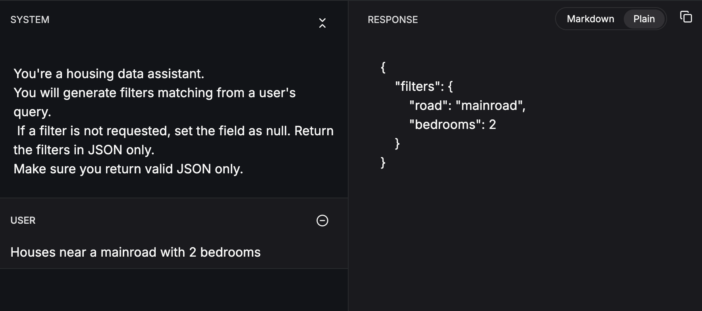
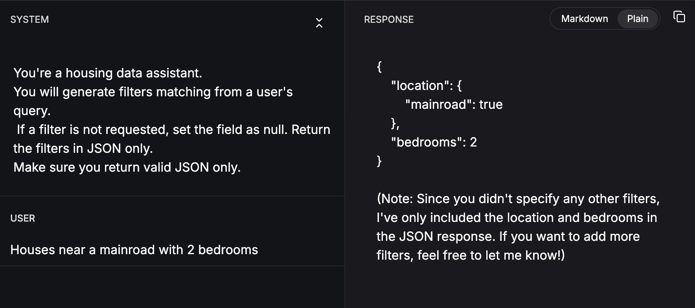
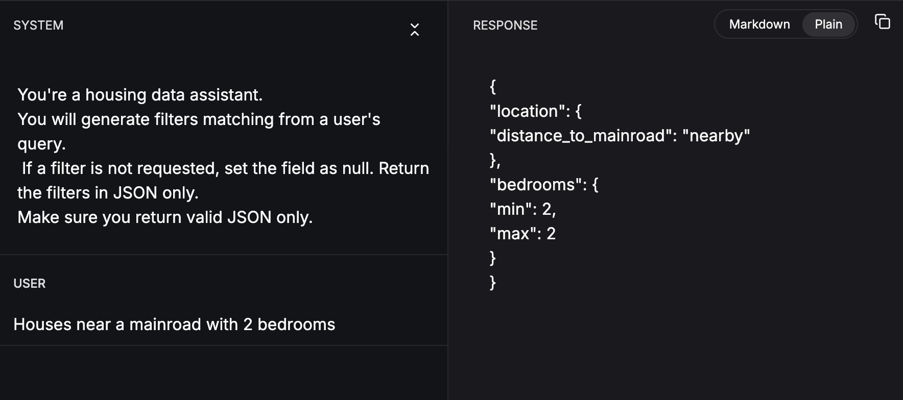

<!-- ---
Author: Douglas Bett
title: Harnessing JSON Schema and Chat Completions API to get reliable & structured LLM outputs. 

--- -->

## 1. Introduction
Talking with Large Language Models.
> Harnessing JSON Schema and Chat Completions API to get reliable & structured LLM outputs. 
---

## 2. Imagine a house finding assistant.

Given a query like:
> I want a house that has 2 bathrooms, located on a main road, have a guest room. It must have hot water heating
---

## 2. Imagine a house finding assistant.
You'd want to get a response like:
```json
{
  "minBedrooms": 0,
  "bathrooms": 2,
  "mainroad": "yes",
  "guestroom": "yes",
  "hotwaterheating": "yes"
}
```
---

## 
> A house with a minimum price of KSH 50,000, without a guest room and has 2 bedrooms

You'd want to get a response like:
```json
{
  "minPrice": 50000,
  "bedrooms": 2,
  "bathrooms": 1,
  "guestroom": "no"
}
```
---

## 3. JSON, JSON,JSON...
> JSON mode

As LLMs can generate text, they can also generate JSON.
- Varies according to model. 
- OpenAI 4o introduced Structured Outputs. Giving you a guarantee that your applications can respond in a specific format. 
---

## 3. JSON, JSON,JSON...
How do we get that JSON?
> PROMPTING
---

## 4. Prompting ?

The art and science of crafting effective inputs for language models

- Enhancing LLM performance on various tasks
- Developing effective interfaces between LLMs and users/tools
- Understanding and expanding LLM capabilities
- Improving LLM safety by controlling things to handle
- Augmenting LLMs with external knowledge(RAG)
<!-- Just like Google captured the world by creating a searchable index of the universe for content that someone wants, 
LLMs excel at generating content from what it knows about. 
And that's the only limitation current LLMs are suffering from.  -->

---
## 5. Limitations of LLMs
- Not being able to perform tasks e.g run code etc.  
- Not being able to get access to real-time/private data. 
- Not understanding what the user wants due to poorly typed prompts. 
<!-- Initial ChatGPT days -->
---

## 5. Limitations of LLMs
- ~~Not being able to perform tasks e.g run code etc.~~
- ~~Not being able to get access to real-time/private data.~~
- ~~Not understanding what the user wants due to poorly typed prompts.~~
- ~~No ability to remember the previous interactions~~

> All these are fixed using the Chat Completions API
---

## 6. Overview of Chat Completions API

> An API style for interacting with LLMs
<center> Designed & made popular by OpenAI </center>
---

## 6. Overview of Chat Completions API

- Enables conversational interactions with language models
- Takes a list of messages as input and returns a message
---

## 6. Example of Chat Completions API request

```python
from openai import OpenAI
client = OpenAI()

response = client.chat.completions.create(
  model="gpt-4o-mini",
  messages=[
    {"role": "system", "content": "You are a helpful assistant."},
    {"role": "user", "content": "Who won the world series in 2020?"},
    {"role": "assistant", "content": "The Los Angeles Dodgers won the World Series in 2020."},
    {"role": "user", "content": "Where was it played?"}
  ]
)
```
---

### Key Features of Chat Completions API

- Supports for multi-turn conversations
- Allows for different message roles (system, user, assistant)
- Enables more natural and context-aware interactions
- To supply the history of the conversation/previous LLM outputs. 
---

## Chat Completion API Message Types
- System Messages
- User Messages
- Assistant Messages

---

### System Messages

- Purpose: Set the overall behavior and context for the model
- Invisible to the end-user
- Persists throughout the conversation
- Sets rules, guidelines, and persona for the AI

---

### System Messages Example
```json
[
  {
    "role": "system",
    "content": "You're a housing data assistant. 
You will generate filters matching from a user's query in JSON Format. Given a query like
A house with a minimum price of KSH 50,000, without a guest room and has 2 bedrooms
You'll return a JSON message with the format
{{
  "minPrice": 50000,
  "bedrooms": 2,
  "bathrooms": 1,
  "guestroom": "no"
}}
If a filter is not requested, set the field as null."
  },
]
```
---

### User Messages

- Purpose: Represent the human's input/query in the conversation
- Contain the actual queries or prompts
- Can include additional context or instructions

Example:
```json
[
  {
    "role": "user",
    "content": "I want a house that has 2 bathrooms, located on a main road, have a guest room. It must have hot water heating"
  }
]  
```

---

### Assistant Messages

-- Act as a form of short-term memory within a single API call
- Allow the model to reference and build upon previous responses
- Enable more coherent and context-aware multi-turn conversations

---

Example:
```json
{
  "role": "assistant",
  "content": "Based on the sales data you provided, I can see an upward trend..."
}
```

---


## Langchain

> a framework for developing applications powered by language models
- Prompt Engineering
- Memory Management
- LLM Configuration
- Output parsers

---

## Langchain Implementations in various languages
- Python -> https://python.langchain.com/
- Javascript -> https://js.langchain.com/
- Flutter & Dart -> https://langchaindart.dev
- Golang -> https://tmc.github.io/langchaingo/
- Java -> https://docs.langchain4j.dev/

---

## Langchain > Prompt Engineering
> LangChain provides a simple and flexible way to define and customize prompts for language models. 
1. Design your prompt
2. Specify the model to call. 
3. Call the model with the prompt. 
4. Handle the output. 

---

## Design your prompt
```dart
final prompt = ChatPromptTemplate.fromPromptMessages(
  [
    ChatMessagePromptTemplate.system("""
      You're a housing data assistant. 
      You will generate filters matching from a user's query.
      If a filter is not requested, set the field as null. Return the filters in JSON only. 
      Make sure you return valid JSON only.
      """
    ),
    ChatMessagePromptTemplate.human('{query}'),
  ],
);
```
---

## Specify your LLM

```dart
final chatModel = ChatOpenAI(
  apiKey: '---',
  defaultOptions: const ChatOpenAIOptions(
    temperature: 1.6,
    model: 'gpt-4o-mini-2024-07-18',
  ),
);
```
---

## Talk to the LLM through langchain
```dart
final chain = prompt.pipe(chatModel).pipe(JsonOutputParser());
final response = await chain.invoke({'query': '2 bedroomed houses near a main road'});
```

---
## Examples Response 1
 

---

## Examples Response 2
 

---
 
## Examples Response 3
 

---

## Consistency
> We need consistent output format that we can use in our programs. 
We need to let the LLM know what are the outputs we're expecting. 

---

## JSON Schema to the rescue
> A JSON schema definition is a JSON object that defines the structure and data types of a JSON object, including the properties it should contain, their data types, and any constraints or validations that should be applied.

---

## Example JSON Schema
```json
{
  'type': 'object',
  'properties': {
    'setup': {
      'type': 'string',
      'description': 'The setup for the joke',
    },
    'punchline': {
      'type': 'string',
      'description': 'The punchline for the joke',
    },
  },
  'required': ['setup', 'punchline'],
}
```
---

## OpenAI Structured Outputs & JSON Mode. 
>  A feature that allows the model to generate JSON output based on a given input and a JSON schema. 
Given a JSON schema, it will allow the model to consistenlty generate JSON that follows a specific schema. 
Enabling you to handle expected inputs & outputs. 

---

## Housing Filters Example
```json
{
  "type": "object",
  "properties": {
    "minPrice": {
      "type": ["integer", "null"]
    },
    "maxPrice": {
      "type": ["integer", "null"]
    },
    "minArea": {
      "type": ["integer", "null"]
    },
    "maxArea": {
      "type": ["integer", "null"]
    },
    "bedrooms": {
      "type": ["integer", "null"]
    },
    "minBedrooms": {
      "type": ["integer", "null"]
    },
    "maxBedrooms": {
      "type": ["integer", "null"]
    },
    "bathrooms": {
      "type": ["integer", "null"],
      "enum": [1, 2, 3, 4]
    },
    "minStories": {
      "type": ["integer", "null"]
    },
    "maxStories": {
      "type": ["integer", "null"]
    },
    "mainroad": {
      "type": ["string", "null"],
      "enum": ["yes", "no", "unspecified"]
    },
    "guestroom": {
      "type": ["string", "null"],
      "enum": ["yes", "no", "unspecified"]
    },
    "basement": {
      "type": ["string", "null"],
      "enum": ["yes", "no", "unspecified"]
    },
    "hotwaterheating": {
      "type": ["string", "null"],
      "enum": ["yes", "no", "unspecified"]
    },
    "airconditioning": {
      "type": ["string", "null"],
      "enum": ["yes", "no", "unspecified"]
    },
    "minParking": {
      "type": ["integer", "null"]
    },
    "maxParking": {
      "type": ["integer", "null"]
    },
    "prefarea": {
      "type": ["string", "null"],
      "enum": ["yes", "no", "unspecified"]
    },
    "furnishingstatus": {
      "type": ["string", "null"],
      "enum": ["furnished", "semi-furnished", "unfurnished", "unspecified"]
    }
  },
  "additionalProperties": false,
  "required": [
    "minPrice",
    "maxPrice",
    "minArea",
    "maxArea",
    "minBedrooms",
    "maxBedrooms",
    "bathrooms",
    "minStories",
    "maxStories",
    "minParking",
    "maxParking",
    "mainroad",
    "guestroom",
    "basement",
    "hotwaterheating",
    "airconditioning",
    "prefarea",
    "furnishingstatus",
    "bedrooms"
  ]
}
```

---

## Examples 1 without JSON schema enforced. 
> A house with  a minimum price of KSH 50,000, without a guest room thats near a mainroad
```json
{
     "min_price": 50000,
     "near_main_road": true
}
```
---

## Example 2 without JSON schema enforced
> I want a house that has 2 bathrooms, located on a main road, have a guest room. It must have hot water heating
```json
{
     "bathrooms": 2,
     "location": "main road",
     "guest_room": true,
     "hot_water_heating": true
}
```
---

## Enforcing JSON Schema with Langchain
```dart
final chatModel = ChatOpenAI(
  apiKey: '---',
  defaultOptions: ChatOpenAIOptions(
    temperature: 1.6,
    model: 'gpt-4o-mini-2024-07-18',
    responseFormat: ChatOpenAIResponseFormat.jsonSchema(
      ChatOpenAIJsonSchema(
        name: 'HouseFilters',
        description: 'Set of house filters',
        strict: true,
        schema: schema,
      ),
    ),
  ),
);
```
---

## Examples with JSON schema enforced
> A house with  a minimum price of KSH 50,000, without a guest room thats near a mainroad
```json
{
  "bathrooms": 2,
  "mainroad": "yes",
  "guestroom": "yes",
  "hotwaterheating": "yes"
}
```
---

## Examples with JSON schema enforced
Show listings with a minimum price of 1000, a maximum price of 5000, at least 2 bedrooms, 2 bathrooms, and an area of at least 1000 square feet, located near a main road.

```json
{
     "minPrice": 1000,
     "maxPrice": 5000,
     "minArea": 1000,
     "minBedrooms": 2,
     "bathrooms": 2,
     "mainroad": "yes"
}
```

---

## Examples with JSON schema enforced
Show listings with a minimum price of 8000, a maximum price of 15000, at least 4 bedrooms, and 3 bathrooms, and located in a preferred area, and with a basement.
```json
{
     "minPrice": 8000,
     "maxPrice": 15000,
     "minBedrooms": 4,
     "bathrooms": 3,
     "basement": "yes",
     "prefarea": "yes"
}
```
---

## 
Show listings with a minimum price of 3000, a maximum price of 6000, at least 2 bedrooms, 1 bathroom, and a minimum area of 800 square feet, and with either a guest room or a furnished room, and a maximum parking space of 3.A house with  a minimum price of KSH 50,000, without a guest room thats near a mainroad

```json
{
     "minPrice": 3000,
     "maxPrice": 6000,
     "minArea": 800,
     "minBedrooms": 2,
     "bathrooms": 1,
     "mainroad": "yes",
     "guestroom": "no",
     "maxParking": 3,
     "furnishingstatus": "furnished"
}
```
---

### DEMO

---

## 6. Conclusion
- If interfacing with LLMs, just use JSON mode. 
- If the model doesn't support JSON Mode, pass the JSON schema and threaten the LLM
---
##  Q&A
Questions please ...

---
## Key Points

- Importance of prompt engineering
- Power of Chat Completions API
- Crucial role of different message types
- Overcoming memory limitations with assistant messages
---